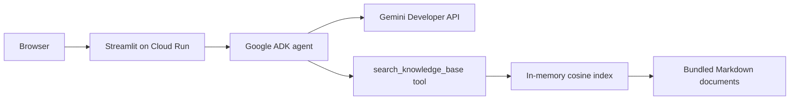

# Knowledge RAG

A small Retrieval-Augmented Generation application over the bundled API learning notes.
It uses **Google ADK** for the agent and tool orchestration, the **Gemini Developer API**
for embeddings and answers, and **Cloud Run** as the Google Cloud hosting service.

## Architecture



The index is built once when the process starts. This is intentionally simple for the
small demo corpus; it does not need a managed vector database.

## Run locally

Prerequisites: Python 3.11+ and a Gemini Developer API key. The app asks for the
key in its sidebar and keeps it only in the active browser session.

```bash
python3 -m venv venv
source venv/bin/activate
pip install -r requirements.txt
```

Start the application:

```bash
streamlit run app.py
```

Open the local URL printed by Streamlit. Ask a question such as `What are the key
characteristics of REST APIs?` The agent calls `search_knowledge_base` and displays the
retrieved source excerpts in the Evidence panel.

## Test

The retrieval and tool-formatting tests do not require an API key or network access:

```bash
python -m pytest tests -q
```

## Deploy to Cloud Run

Cloud Run requires a Google Cloud project with billing enabled, even when demo use stays
within free allowances. Install and authenticate the Google Cloud CLI, then set your
deployment project:

```bash
gcloud auth login
gcloud config set project YOUR_PROJECT_ID
```

Deploy the public demo service:

```bash
export GOOGLE_CLOUD_PROJECT=YOUR_PROJECT_ID
chmod +x scripts/deploy.sh
./scripts/deploy.sh
```

The deployment builds from [Dockerfile](Dockerfile), starts Streamlit on Cloud Run's
`$PORT`, keeps one instance warm, and allows up to ten instances with eighty concurrent
requests each so Streamlit's WebSocket and frontend asset requests can load together.

Each visitor signs in to their own Google account at
<https://aistudio.google.com/apikey>, selects or creates their own Google Cloud project,
and creates a Gemini API key. They paste that key into the app sidebar. Their Google
account password, OAuth token, and Google Cloud project credentials are never requested
by or sent to this app.

## Security and cost

- The deployment command uses `--allow-unauthenticated`, so anyone with the URL can ask
	questions about the bundled knowledge base. Do not include confidential documents.
- Each visitor's Gemini API key is held in the Streamlit session and used for requests on
	their behalf. The app does not write it to disk or configure it as a Cloud Run secret.
- The service keeps each visitor's embeddings and conversation in process memory. They
	are discarded when the browser session ends or the instance stops.
- Users should restrict their keys in Google Cloud to the Gemini Developer API and revoke
	any key accidentally shared in source control, chat, or documentation.

## Developer workflow

The optional VS Code Copilot agents in [.github/agents](.github/agents) remain available
for local development and document exploration. They are separate from the runtime Google
ADK agent used by the deployed application.